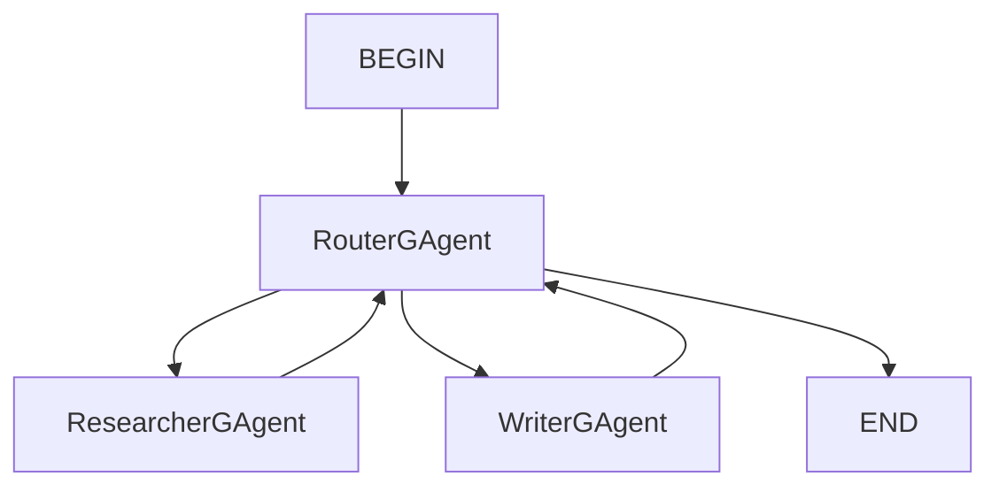

# Router Workflow Sample

This sample demonstrates how to handle user instructions by using Router GAgent.

## Agents

### 1. RouterGAgent
- **Role**: Route to the correct GAgent according to user instructions.
- **Event Handler**:
    - `BeginTaskGEvent`: When receiving `BeginTaskGEvent`, `RouterGAgent`  will route to the correct GAgent according to the user instructions.

### 2. ResearcherGAgent
- **Role**: Conduct research according to user instructions.
- **Event Handler**:
    - `ResearchEvent`: When receiving `ResearchEvent`, `ResearcherGAgent` will conduct research according to user instructions.

### 3. WriterGAgent
- **Role**: Write an article based on the input
- **Event Handler**:
  - `WriteEvent`, When receiving `WriteEvent`, `WriterGAgent` will write an article based on the input.

## Relationships between agents



## Running the Projects

### Configure AI services config
Open silo's configuration file (../Samples/RouterWorkflow/src/RouterWorkflow.Silo/appsettings.json) and configure the AIServices section. 

```json
"AIServices": {
  "AzureOpenAI": {
    "Endpoint": "",
    "ChatDeploymentName": "",
    "ApiKey": ""
  },
  "AzureOpenAIEmbeddings": {
    "Endpoint": "",
    "DeploymentName": "",
    "ApiKey": ""
  }
}
```
### Start the Silo Project

Navigate to the Silo project directory (../Samples/RouterWorkflow/src/RouterWorkflow.Silo/) and run the following command:

```sh
dotnet run
```

### Start the Client Project

Navigate to the Client project directory (../Samples/RouterWorkflow/src/RouterWorkflow.Client/) and run the following command:

```sh
dotnet run
```

By following these steps, you will be able to start the Silo Host and interact with GAgents using the Client project.

## Technologies Used
- [.NET Core](https://dotnet.microsoft.com/)
- [Orleans](https://dotnet.github.io/orleans/)
- [AevatarAI](https://aevatar.ai/)